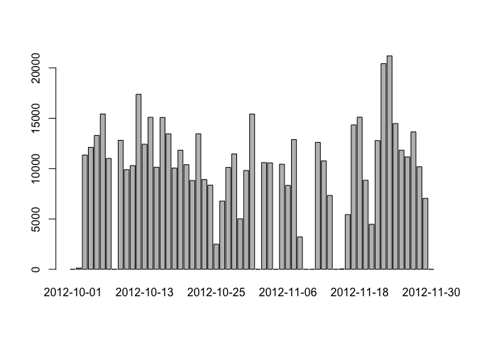
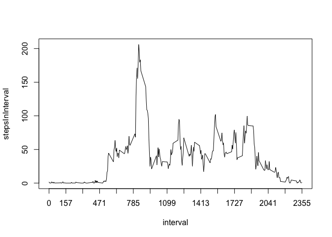
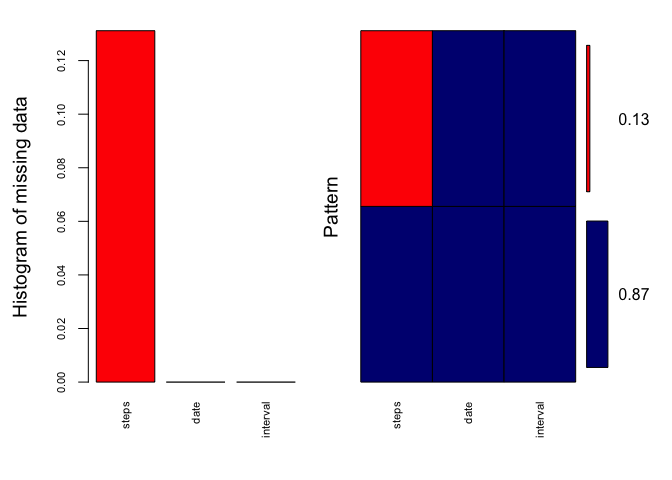

# Reproducible Research: Peer Assessment 1


## Loading and preprocessing the data

```r
library(dplyr)
```

```
## 
## Attaching package: 'dplyr'
```

```
## The following objects are masked from 'package:stats':
## 
##     filter, lag
```

```
## The following objects are masked from 'package:base':
## 
##     intersect, setdiff, setequal, union
```

```r
download.file("https://d396qusza40orc.cloudfront.net/repdata%2Fdata%2Factivity.zip", "activity.zip") 
unzip("activity.zip")

########################  Read data in csv format  ######################
Activity_Pre <- read.csv("activity.csv")
summary(Activity_Pre)
```

```
##      steps                date          interval     
##  Min.   :  0.00   2012-10-01:  288   Min.   :   0.0  
##  1st Qu.:  0.00   2012-10-02:  288   1st Qu.: 588.8  
##  Median :  0.00   2012-10-03:  288   Median :1177.5  
##  Mean   : 37.38   2012-10-04:  288   Mean   :1177.5  
##  3rd Qu.: 12.00   2012-10-05:  288   3rd Qu.:1766.2  
##  Max.   :806.00   2012-10-06:  288   Max.   :2355.0  
##  NA's   :2304     (Other)   :15840
```

```r
##Conver character to date format and see if i have done the right conversion
Activity_Pre$date <- as.Date(Activity_Pre$date)
sapply(Activity_Pre, class)
```

```
##     steps      date  interval 
## "integer"    "Date" "integer"
```


## What is mean total number of steps taken per day?

```r
MakePlot_1 <- function(dataset, suffix_char, ...){
  dataset <- group_by(dataset, date)
  assign(paste("steps_sum", suffix_char, sep = ""), summarise(dataset, sum(steps, na.rm = TRUE)), pos = ".GlobalEnv")
  barplot(get(paste("steps_sum", suffix_char, sep = ""))$`sum(steps, na.rm = TRUE)`, names.arg = get(paste("steps_sum", suffix_char, sep = ""))$date, ... )
  assign(paste("steps_mean", suffix_char, sep = ""),summarise(dataset, mean(steps, na.rm = TRUE)), pos = ".GlobalEnv" )
  assign(paste("steps_median", suffix_char, sep = ""),summarise(dataset, median(steps,na.rm = TRUE)), pos = ".GlobalEnv")
}
MakePlot_1(Activity_Pre, "")
```

\

```r
mean(steps_sum$`sum(steps, na.rm = TRUE)`, na.rm = T)
```

```
## [1] 9354.23
```

```r
median(steps_sum$`sum(steps, na.rm = TRUE)`, na.rm = T)
```

```
## [1] 10395
```


## What is the average daily activity pattern?

```r
Activity_Pre <- group_by(Activity_Pre, interval)
timeseries <- summarise(Activity_Pre, mean(steps, na.rm = T))
names(timeseries) <- c("interval", "stepsInInterval")
with(timeseries, plot(interval, stepsInInterval, type = 'l', xaxt = 'n')) ## [KP] cancel x axis 
axis(1, seq(min(timeseries$interval), max(timeseries$interval),   ## [KP] add x axis
            by = (max(timeseries$interval)-min(timeseries$interval))/15))
```

\

```r
##Get the interval contains the maxim average steps
timeseries$interval[which(timeseries$stepsInInterval == max(timeseries$stepsInInterval))]
```

```
## [1] 835
```


## Imputing missing values

```r
############Missing value exploration
if (!require(mice)) { ##[KP] package look missing values in number
  install.packages("mice")
  library(mice)
}
```

```
## Loading required package: mice
```

```
## Loading required package: Rcpp
```

```
## mice 2.25 2015-11-09
```

```r
##Calculated and report total number of missing values in each column
md.pattern(Activity_Pre)
```

```
##       date interval steps     
## 15264    1        1     1    0
##  2304    1        1     0    1
##          0        0  2304 2304
```

```r
if(!require("VIM")) { ##[KP] package look missing values in picture
  install.packages("VIM")
  library(VIM)
}
```

```
## Loading required package: VIM
```

```
## Loading required package: colorspace
```

```
## Loading required package: grid
```

```
## Loading required package: data.table
```

```
## 
## Attaching package: 'data.table'
```

```
## The following objects are masked from 'package:dplyr':
## 
##     between, last
```

```
## VIM is ready to use. 
##  Since version 4.0.0 the GUI is in its own package VIMGUI.
## 
##           Please use the package to use the new (and old) GUI.
```

```
## Suggestions and bug-reports can be submitted at: https://github.com/alexkowa/VIM/issues
```

```
## 
## Attaching package: 'VIM'
```

```
## The following object is masked from 'package:datasets':
## 
##     sleep
```

```r
aggr_plot <- aggr(Activity_Pre, col=c('navyblue','red'), numbers=TRUE, sortVars=TRUE
                  ,labels=names(data), cex.axis=.7, gap=3
                  ,ylab=c("Histogram of missing data","Pattern"))
```

\

```
## 
##  Variables sorted by number of missings: 
##  Variable     Count
##     steps 0.1311475
##      date 0.0000000
##  interval 0.0000000
```

```r
############Impute missing value by interval
Activity_Impute <- Activity_Pre
interval2steps <- function(interval) {
  timeseries[timeseries$interval == interval, ]$steps
}
count = 0  # Count the number of data filled in
for (i in 1:nrow(Activity_Impute)) {
  if (is.na(Activity_Impute[i, ]$steps)) {
    Activity_Impute[i, ]$steps <- interval2steps(Activity_Impute[i, ]$interval)
    count = count + 1
  }
}
cat("Total ", count, "NA values were filled.\n\r")
```

```
## Total  2304 NA values were filled.
## 
```

## Are there differences in activity patterns between weekdays and weekends?

```r
Activity_Impute$date <- as.Date(Activity_Impute$date)

work_day <- c("星期一","星期二","星期三","星期四","星期五")
Activity_Impute_week <- transform(Activity_Impute, weekOrweeken = ifelse(weekdays(Activity_Impute$date) %in% work_day, "weekday", "weekend"))  

library(lattice)
names(airquality)
```

```
## [1] "Ozone"   "Solar.R" "Wind"    "Temp"    "Month"   "Day"
```

```r
Activity_Impute_week <- transform(Activity_Impute_week, weekOrweeken = factor(weekOrweeken))
Activity_Impute_week <- group_by(Activity_Impute_week, interval, weekOrweeken)
groups(Activity_Impute_week)
```

```
## [[1]]
## interval
## 
## [[2]]
## weekOrweeken
```

```r
Activity_Impute_week_mean <- mutate(Activity_Impute_week, step_means = mean(steps))
png(filename = 'plot.png',width = 480, height = 480, bg = rgb(0,0,0,alpha = 0))
xyplot(step_means~interval | weekOrweeken, data = Activity_Impute_week_mean, type='l', layout = c(1,2),ylab = "Number of steps")
dev.off()
```

```
## quartz_off_screen 
##                 2
```

```r
xyplot(step_means~interval | weekOrweeken, data = Activity_Impute_week_mean, type='l', layout = c(1,2),ylab = "Number of steps")
```

\

